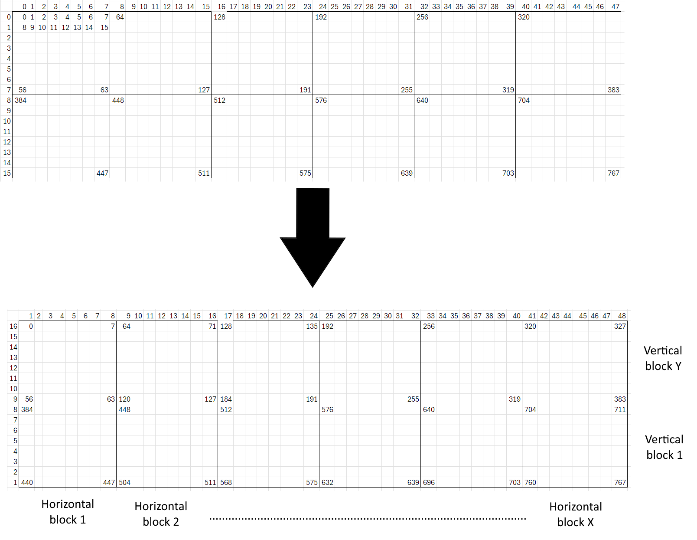

# DEMO

Under this link:

    https://www.youtube.com/watch?v=fhAaeFVRgR0

---

# LED Audio Visualizer

A Python-based real-time **audio spectrum visualizer** for LED matrices built with **NeoPixel (WS2812)**.

The program captures audio input, performs an FFT analysis, and maps frequency bands to colorful LED bars on the matrix.  
It creates a smooth, rainbow-style animation that reacts to sound in real time.

---

# Features

- Real-time audio capture using `sounddevice`
- FFT-based frequency analysis with logarithmic binning
- Adjustable matrix size and audio device index
- Smooth decay effect between frames
- Rainbow color cycling across the LED strip
- Shutdown with `Ctrl+C`

---

# Installation

1. Clone the repository:

   ```bash
   git clone https://github.com/alelys/audio-visualizer.git
   cd audio-visualizer
   python3 -m venv venv
   source venv/bin/activate

   ```

2. Install dependencies:

   ```bash
   pip install -r requirements.txt

   ```

---

# Usage

Connect your NeoPixel LED matrix to pin D9 (can be changed in visualizer/leds.py),
then run:

    python main.py

---

# Configuration

Most important settings are stored in visualizer/config.py

- WIDTH, HEIGHT – LED matrix dimensions
- DEVICE_INDEX – your audio input device index
- VOL_MIN, VOL_MAX – minimum/maximum volume scaling
- MAX_FREQ – maximum analyzed frequency
- TARGET_FPS – frames per second
- N_RAINBOWS – number of rainbows across the LED strip

---

# IMPORTANT

This program's functionality depends on your hardware configuration. My LED matrix is built from 12 standard 8x8 WS2812B LED boards, creating a 48x16 matrix.
If your LED board is also made of 8x8 elements, it should work after adjusting the settings in config.py.
If you are using different components, you may need to modify the xy_to_num() mapping function.



---

# Requirements

- Python 3.9+
- NeoPixel LED matrix (WS2812 or compatible)
- A microphone or audio input device
